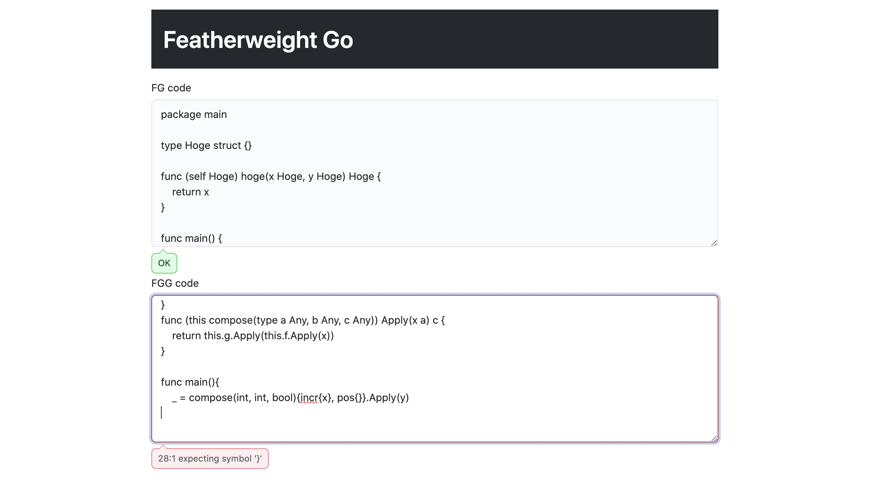

# featherweight-go


Implement [Featherweight Go](https://arxiv.org/abs/2005.11710) using Elm



## Implement

- [x] FG code parser
- [x] FG type checker
- [x] FGG code parser
- [ ] FGG type checker
- [ ] Monomorphisation

## Build

```
$ elm make app/Main.elm --output=docs/static/main.js
```
